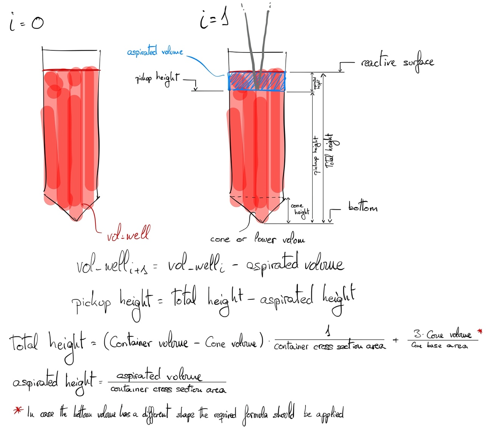

**Documentation in progress**

*Height adjustment*

Due to the unavailability of liquid detection on the tip's edge, height position from which the pipette must aspirate has to be fed as a parameter. Going directly to the bottom of each well is not a good mean of procedure, as it could touch the bottom of the well and not aspirate correctly the needed amount of reactive volume, neither sinking the tip to the bottom edge which would induce the flooding of the pipette itself and prompt its malfunction. Furthermore, each reactive container can have different shapes and sizes, which makes the task of calculating the aspiration height non trivial. 

For this reason, the shape of the container and the unusable volume are fed as parameters within this function in order to calculate the exact height of the reactive surface in the well and then the height at which the surface will remain after the aspiration, which in turn would be the depth at which the tip should be submerged as shown in Fig. XX. Indeed, wetting of the tip is minimized, reducing the risk of droplet formation.

 As a further iteration, when one container is not enough for all the samples and multiple containers are used to hold all the needed volume. For this reason, the robot must know when should it change from one container to the following one. To achieve this container swap, the containers’ addresses [Reactive.reagent_reservoir] are stored within the reactive class and a column counter [Reactive.col] controls which container should it aspirate volume from, giving the robot the knowledge of the remaining volume in each of the wells [Reactive.vol_well] and allowing an easy swap between containers.
